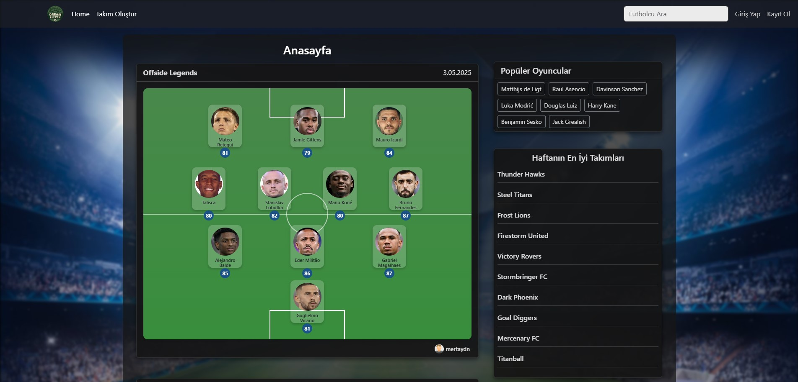
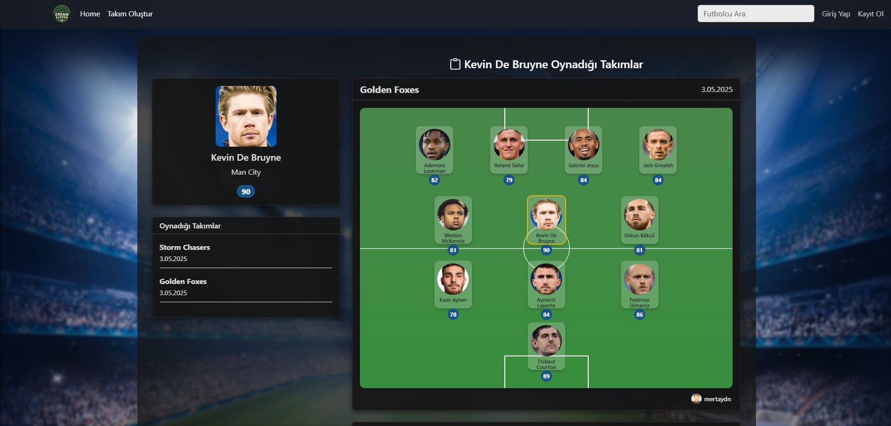
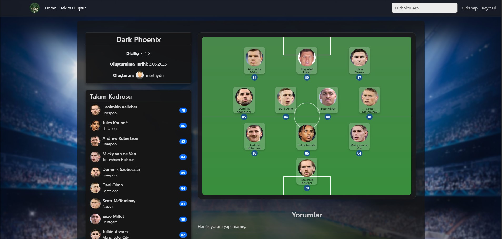
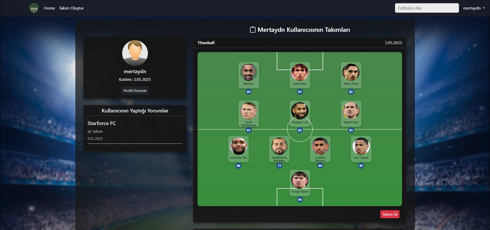
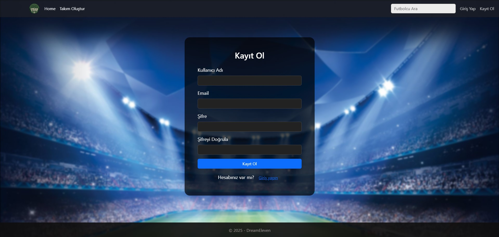

**Proje Adı: Dream Eleven**

---

# 🌟 Dream Eleven Nedir?
Dream Eleven, kullanıcıların haftanın en iyi ve en popüler oyuncularını takip edip kendi ideal takımlarını kurabilecekleri özel bir web platformudur.

Bu platformda:
- 📊 Kullanıcılar kendi takımlarını kurar.
- 🔍 Futbolcu arayıp detay profiline ulaşabilir.
- 🏆 Haftanın en iyi takımları görülür.
- 📊 Popüler oyuncular ve günün oyuncusu seçilir.
- 🚶️‍♂️ Kendi profilinizi düzenleyebilirsiniz.

---

# 🌐 Kullanılan Teknolojiler
- **ASP.NET Core MVC 8.0**
- **Entity Framework Core**
- **SQL Server LocalDB**
- **Identity (Authentication & Authorization)**
- **HTML5, CSS3**
- **Bootstrap 5.3**
- **JavaScript Fetch API**

---

# 🔧 Nasıl Kurulur?

### 1. Projeyi Çalıştırmak İçin:
- 📂 ZIP dosyasını açın.
- 🔢 Visual Studio 2022+ ile **DreamEleven.sln** dosyasını açın.
- `appsettings.json` dosyasında LocalDB ayarları hazırdır.
- PM Console üzerinden:
    ```bash
    Update-Database
    ```
### 2. Gerekli NuGet Paketleri:
- Microsoft.EntityFrameworkCore
- Microsoft.EntityFrameworkCore.SqlServer
- Microsoft.AspNetCore.Identity.EntityFrameworkCore
- Microsoft.AspNetCore.Identity.UI
- Microsoft.AspNetCore.Mvc.Razor.RuntimeCompilation

---

# 🔎 Öne Çıkan Özellikler

- **Modern ve şık tasarım:**
  - Arka planda şampiyonlar ligi atmosferi.
  - Sayfa geçişlerinde arka plan sabit.
  - Kartlar yarı saydam ve şeffaf efektler kullanıldı.

- **Login & Register:**
  - Özel login/register sayfaları.
  - Validasyonlar ve şık input tasarımları.

- **Takım Oluşturma:**
  - Sahaya oyuncuları pozisyonlarına yerleştir.
  - Özel futbol sahası tasarımı.

- **Search Feature:**
  - Canlı olarak futbolcu arama (fetch & debounce sistemi ile).

- **Session Management:**
  - Haftanın popüler takımları ve oyuncuları sayfa yenilense bile sabit kalır.

---

## 📸 Görüntüler

### Ana Sayfa


### Oyuncu Detayları


### Takım Detayları


### Kullanıcı Detayları


### Giriş / Kayıt Sayfaları
